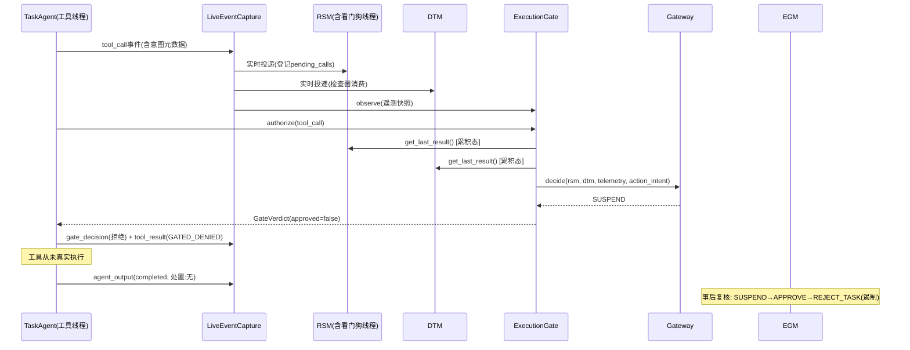

# OrbitGuard 技术全景与面试终稿

> 生成方式：对最终版本代码（commit `1eb4b16` 之后，含 CI 编码修复与 dashboard 数字同步）逐模块精读 +
> 本机与 GitHub Actions 实测。**所有数字均可复现**：149/149 测试、benchmark 9/9（单故障）+ 3/3（复合逐故障）、
> 覆盖率 45.5%（10/22）、正常场景 12/12 PERMIT、CI 5/5 全绿。
> 全文只写代码里真实存在的东西；未实现的标注【代码中未体现】，简历里严禁出现。

---

# 【任务一】技术全景清单

> 共 15 个技术点。每个技术点按「原理 / 关键数据结构 / 应用原因 / 性能特征 / 可优化 / 压力面追问」展开。

## T1. 装饰器 + 运行时方法替换的非侵入式注入（Python Decorator & Monkey-patching）

- **原理**：`fault_injector/injector.py:274` 的 `inject_execution` 用 `@functools.wraps` 包裹原函数，在调用前后插桩；更关键的是 `task_agent.py:75` 的**运行时替换**——`self.tool_registry.call = self._wrap_tool_call(self.tool_registry.call)`，把故障注入层挂在"调用点"上而不是改 `tools.py` 本体。等价于 AOP 的 around advice，但用闭包实现。
- **关键数据结构**：闭包（wrapper 捕获 `func`/`self`）、`functools.WRAPPER_ASSIGNMENTS` 保留的 `__name__`/`__doc__` 元数据。
- **应用原因**：被测对象（Agent 核心逻辑）与测试工具解耦——不侵入意味着"被测的就是生产代码，而不是为测试改过的代码"，这是故障注入有效性的前提。替代方案（手工插桩）会污染生产代码；子类化需要预埋 hook 点。
- **性能特征**：每次工具调用多一层 Python 函数调用（约 μs 级），对 0.5s 的任务周期可忽略。
- **可优化**：已是该场景的最佳实践；若注入点变多可改为事件回调列表（避免 wrapper 嵌套过深）。
- **压力面追问**：
  - "为什么用运行时替换 `tool_registry.call` 而不是装饰器？"→ 装饰器在类定义时生效，无法按 config.json 运行时开关；运行时替换让"改配置即切换正常/故障"成为可能。
  - "`functools.wraps` 不写会怎样？"→ `__name__` 全变 `wrapper`，Ground Truth 日志里 target 字段就失去辨识度。

## T2. 故障分层与组合约束建模（Fault Taxonomy & Terminal-Mutex Composition）

- **原理**：`FaultLayer` 枚举把注入分为**执行层**（改函数行为：崩溃/死循环/超时/内存/重复调用）与**数据层**（改输入输出：诊断/置信度/证据/传感器）；`TERMINAL_FAULTS = {infinite_loop, process_crash}` 与 `NON_TERMINAL_FAULTS` 用集合建模故障间关系——终结性故障触发后函数不会正常返回，**互斥**是语义正确性要求而非性能优化。`INTENSITY_PRESETS` 用 dict 三档预设 + "显式配置优先"合并。
- **关键数据结构**：`set`（成员判定 O(1)）、`Dict[str, Dict]` 配置树、`_active_faults` 触发标记。
- **应用原因**：9 类故障 × 3 档 × 多故障叠加的空间是 22 维（coverage_report 建模），组合约束防止"同时注入崩溃和死循环"这类无意义场景，也让叠加实验的期望行为可预测。
- **性能特征**：纯内存判定，零开销。
- **可优化**：可把组合规则外置成约束 DSL（当前硬编码在集合里），便于扩展新故障。
- **压力面追问**：
  - "终结性故障为什么必须互斥？"→ 两个终结性故障同时触发时只有一个能执行，另一个的 ground truth 永远无法验证，会污染检测率统计。
  - "三档强度怎么保证线性可比？"→ 不是线性设计，是**场景分级**：light 用于检测器灵敏度边界，heavy 用于最坏情况；各故障的档位参数是独立物理量（MB/秒/次数）。

## T3. 多线程守护模型（Daemon Threads + Lock/Event）

- **原理**：`task_agent.py` 起 3 个 daemon 后台线程（心跳 5s/遥测 1s/资源采样 1s 周期，用 `time.sleep(interval)` 做节奏器），主线程跑 6 步任务；`rsm/monitor.py` 另起**看门狗线程**。共享状态（step 计数器、GT 记录、许可表）用 `threading.Lock` 保护；看门狗停复用 `threading.Event`。Python 的 GIL 使 CPU 密集型多线程无法并行，但本项目的线程主体是 sleep 节奏 + 事件处理，属于 IO/等待密集，GIL 不是瓶颈。
- **关键数据结构**：`threading.Thread(daemon=True)`、`threading.Lock`、`threading.Event`、`_running` 布尔停机标志。
- **应用原因**：模拟"Agent 进程"与"监护进程"两个独立生命周期——心跳/遥测必须在任务卡死时继续发出，这正是所有挂起类故障能被检测的前提。替代方案 asyncio 单线程会引入 await 传染且难以模拟"线程独立存活"。
- **性能特征**：线程切换 ~μs 级；空闲时线程 sleep，CPU 占用 ≈0（resource 事件实测 cpu_percent=0.0）。
- **可优化**：daemon 线程如果循环体不检查 `_running` 会泄漏（本项目踩过这个坑并已修复：忙等循环 `while self._running: pass`）。
- **压力面追问**：
  - "GIL 下忙等死循环不会饿死心跳线程吗？"→ 会间歇饿死但不会饿死透：CPython 每 5ms 有 eval-breaker 强制让出 GIL，心跳最多被延迟一个调度片；且 CPU 判别用的是"持续高占用"签名，单次抖动不影响。
  - "为什么不用多进程？"→ 进程隔离更真实但失去共享内存便利；本项目用"独立看门狗线程 + 墙钟"折中，并在文档承认进程级隔离是生产化方向【代码中未体现多进程】。

## T4. 墙钟驱动看门狗 + CPU 特征判别（Wall-Clock Watchdog & CPU-Signature Classification）

- **原理**：事件驱动监护有个**死区**——Agent 崩溃后不再发事件，任何"靠新事件触发检查"的判定都会死等。`rsm/monitor.py:192` 的看门狗线程不依赖事件流，每 0.1s 用 `time.time()` 墙钟推进三类超时：心跳缺失 → PROCESS_CRASH；**工具挂起时用最近一次 `cpu_percent` 采样判别**（≥50% 忙等 → INFINITE_LOOP，<50% 阻塞 → NO_OUTPUT_TIMEOUT）；无未决工具调用才允许停滞判定。`agent_shutdown` 事件携带原因（normal_shutdown/agent_fault），正常停机不判崩溃。
- **关键数据结构**：`pending_calls: Dict[call_id → {tool_name, call_time_ms}]`、`_last_cpu_percent` 标量、`attributed` 归因标志、`_watchdog_lock`。
- **应用原因**：这是本项目最核心的架构修正——"监护者必须与被监护者隔离 + 不依赖被监护者产出"是嵌入式看门狗的第一原则。
- **性能特征**：0.1s 轮询 × O(pending_calls) 扫描，空闲开销可忽略。
- **可优化**：轮询可改条件变量唤醒（省空转）；CPU 判别可加多次采样中位数防抖。
- **压力面追问**：
  - "心跳超时的 1s 阈值怎么定的？"→ 演示阈值 = 心跳周期 0.2s × 5 倍余量；生产需按最坏调度时延推导（WCET），当前是工程常数【阈值依据未量化，诚实讲】。
  - "shutdown 事件本身丢了怎么办？"→ 会退化到老行为：正常停机被误报崩溃。当前靠"事件与心跳同总线"的假设，真正的解法是看门狗与停机握手（如停止前主动置位标志），已部分实现。

## T5. 累积式检测结果与归因抑制（Cumulative Results & Fault Attribution）

- **原理**：`process_event` 每事件新建结果对象会把历史检出**覆盖**掉（本项目实打实踩过：DTM 检查器全触发但 `get_last_result()` 返回 0 issue）。修复为 `_cumulative_result` 单例持续追加；`add_issue` 对同检测器同故障类型**去重**；工具挂起一旦归因（`attributed`），停滞判定被抑制，避免"挂起 → 被误接力成死循环"。
- **关键数据结构**：`_cumulative_result: RSMResult/DTMResult`、`issues: List[Dict]`、`attributed: bool`。
- **应用原因**：`get_last_result()` 是 Gateway/Gate 的消费接口，它必须表达"到目前为止发生过什么"，而非"最后一个事件是什么"。
- **性能特征**：追加 O(1)、去重 O(issues)。
- **可优化**：issues 无限增长可加窗口裁剪；去重键可换成 (detector, call_id)。
- **压力面追问**："为什么 Gateway 不能直接消费逐事件结果？"→ 逐事件结果是"快照"语义，汇合判定需要"累积"语义；两者并存，接口命名要分清楚（`get_last_result` vs `process_event` 返回值）。

## T6. 滑动窗口趋势与连续计数检测（Sliding-Window Trend & Consecutive Counting）

- **原理**：内存泄漏检测双判据——绝对阈值（>300MB）+ 滑动窗口内**单调递增**且累计增长 >50MB（`growth_window=5` 采样点）；重复调用检测用 `consecutive_count` 连续同工具计数，遇到不同工具重置，≥4 次触发。两者都在捕获"过程性异常"而非"瞬时值异常"。
- **关键数据结构**：`memory_history: List[float]`（长度受窗口约束的滚动列表）、`consecutive_count: int` + `last_tool`。
- **应用原因**：瞬时报点是噪声，趋势才是泄漏；连续计数避免"偶发重复调用"误报。
- **性能特征**：O(窗口) 扫描，窗口 ≤5 可忽略。
- **可优化**：单调窗口可用差值累积替代全窗口扫描；重复检测可加时间衰减（太久远的连续调用不应算）。
- **压力面追问**："窗口 5 个采样点怎么选的？"→ 与采样周期（1s）和故障注入步长（50MB/步）匹配：5s 内 3 步即可见 150MB 增长；换采样周期要重估窗口，这是参数耦合点。

## T7. 结构化事件流与观察者总线（Structured Event Stream & Observer Bus）

- **原理**：全链路以 11 类 JSON 事件通信（heartbeat/telemetry/resource/task_progress/diagnosis/tool_call/tool_result/agent_output/packet_loss/agent_shutdown/gate_decision），公共字段 `run_id/global_seq/schema_version/agent_id` 保证可追踪与可重放；`tool_call` 与 `tool_result` 用 `call_id` 配对。`LiveEventCapture.publish` 是**观察者 fan-out**：缓存事件的同时实时投递给 RSM/DTM/Gate 三个观察者——这是前置门控能"按此刻状态裁决"的前提。
- **关键数据结构**：`events: List[Dict]`（有序缓存）、`observers: List[Callable]`、`pending_calls` 配对表。
- **应用原因**：事件是五个模块之间唯一的耦合介质，任何模块只认事件不认对象引用；与 README 声明的"后续替换 Redis Pub/Sub"对齐【Redis 未实现，代码中仅进程内回调】。
- **性能特征**：单事件 publish 为 list append + 3 个观察者调用，μs 级；事件 JSON 序列化是主要开销。
- **可优化**：JSON 序列化可用 msgpack/二进制帧替代；总线可加背压与丢弃策略（当前无界 append，长跑会涨内存）【未实现】。
- **压力面追问**："进程内 list 当总线，事件丢了或乱序了怎么办？"→ 单进程内 list append 不丢不乱序；跨进程/上星后必须换真实总线并补序列号重排与丢失检测——`global_seq` 字段就是为这个预留的，但重排逻辑【代码中未实现】。

## T8. 哈希证据绑定与 Ground Truth 隔离（Hash-Based Evidence Binding & GT Isolation）

- **原理**：遥测帧发布 `telemetry_hash = SHA256(json.dumps(sort_keys=True))[:16]`，agent_output 引用该哈希，使"结论 ↔ 证据帧"绑定可验证；门控许可用 `binding_digest = SHA256(tool_name+args+call_id+功率/热增量)[:16]` 与具体动作绑定；**Ground Truth 日志只落本地 JSONL、绝不上事件总线**，保证监护器运行时看不到标准答案。
- **关键数据结构**：`hashlib.sha256`、`GroundTruthLogger`（Lock + 追加写 + 内存 records）。
- **应用原因**：`sort_keys` 保证同内容同哈希（确定性）；GT 隔离是"检测率可信"的根基——否则 100% 就是自欺欺人（本项目第一版 benchmark 正是空转才得到假 100%）。
- **性能特征**：SHA256 对 KB 级 JSON 为 μs 级。
- **可优化**：截断 16 hex（64bit）够防误碰、不够防恶意篡改，生产应存全量摘要 + 密钥签名（HMAC）【未实现】。
- **压力面追问**："SHA256 截断到 16 位凭什么够？"→ 防的是意外不一致与低强度重放，不是密码学对抗；对抗场景要 HMAC/签名，代码里没有——诚实回答。

## T9. 一次性许可状态机与执行前置门控（One-Time Permit State Machine & Pre-Execution Gating）

- **原理**：EGM 是 8 态状态机（PENDING_HUMAN→PERMIT_ISSUED→STATE_CHECK→EXECUTING→COMPLETED/REJECTED/STATE_CHANGED/SAFE_HOLD）；`Permit` 对象携带 action_digest/state_digest/expiry/used，`consume()` 一次性生效。`egm/gate.py` 的 `ExecutionGate.authorize()` 把 Gateway 裁决前移到工具执行之前：BLOCK/SUSPEND 一律拒绝（自动态严格），仅 PERMIT 由 EGM 签发许可；`consume()` 校验 binding_digest 与 used 标记防**重放与挪用**；被拦截工具返回 GATED_DENIED 并记审计。
- **关键数据结构**：`_permits: Dict[permit_id → Permit]`、`_issued: {binding, used}`、`GateVerdict`。
- **应用原因**：旧链路"Agent 跑完 → Gateway 事后判定 → EGM 事后模拟"没有任何真实拦截力；前置门控把 EGM 从"审计器"变成"闸门"。双审批语义：前置门控自动态严格（REJECT），事后复核才模拟人工（APPROVE 批准的是遏制动作而非补批工具）。
- **性能特征**：authorize 同步阻塞工具线程，含一次 Gateway 裁决 + 一次 EGM 签发，实测 μs~0.2ms 级。
- **可优化**：许可存内存 dict，重启即失【未持久化】；可加"签发即记审计、消费即销账"的闭环（已部分实现）。
- **压力面追问**："Agent 绕过 gate 直接调 `tool_registry.call` 怎么办？"→ 门控在 Agent 层是**自律**，防的是"Agent 不可信"而非"Agent 恶意对抗"；强制执行必须下沉到执行器侧只认许可【未实现，已知边界】。

## T10. 三级路由与增量物理约束（Priority Routing & Incremental Physical Constraints）

- **原理**：`gateway.decide` 按 **BLOCK > SUSPEND > PERMIT** 优先级短路判定；输入 = RSM 累积结果 + DTM trust_score + 遥测快照 + **动作意图**。C1-C5 除绝对阈值外还有**增量投影**：`当前功耗 + power_delta_w` 与 `发电×0.95` 比较，"这个动作会不会把系统推出边界"；`requires_approval` 或不可逆变异动作强制 SUSPEND。遏制等级 ISOLATE/TOOL_RESTRICT/PLANNING_BLOCK/NONE 与路由绑定。
- **关键数据结构**：`DEFAULT_CONSTRAINTS` 阈值字典、`PhysicalCheckResult`、`GatewayDecision.reasons`（去重列表）。
- **应用原因**：绝对阈值只能反映"现在是否越界"，增量投影才能拦住"即将越界"的动作——这是门控裁决和事后巡检的本质区别。
- **性能特征**：5 个常量比较 + 2 个投影，纳秒级。
- **可优化**：投影假设功率可线性叠加，真实器件切换有瞬态尖峰，应改用带裕度的阶跃模型【未实现】；阈值应有出处文档【未实现】。
- **压力面追问**："C1-C5 阈值哪来的？"→ 工程演示值（60°C/20% SOC/1e-4 碰撞等），未对齐具体星上规范，诚实说"演示参数，生产要按任务书重新标定"。

## T11. 可信度量化模型（Trust Scoring & Risk Labeling）

- **原理**：DTM 四个检查器各自输出 `confidence_penalty`（0.2/0.25/0.3/0.35），`trust_score` 从 1.0 开始**加性扣减**（clamp 到 0），按阈值映射 risk_label（≥0.8 low / ≥0.6 medium / ≥0.4 high / else critical），critical 级别 issue 直接升档。`NO_FAULT` 结论跳过校准与完整性检查（避免正常诊断被误报——本项目踩过并修复）。
- **关键数据结构**：`DTMResult.issues`、`confidence_penalty` 字段、检查器 `_*_found` 一次性触发标志。
- **应用原因**：加性扣分可解释、可叠加（多问题同时存在时分数单调下降）；相比乘积式更直观，代价是权重不可调。
- **性能特征**：每条诊断 4 个检查器常数时间。
- **可优化**：扣分值没有校准数据支撑【未校准，诚实讲】；可引入证据强度加权的贝叶斯/证据理论。
- **压力面追问**："0.2/0.25/0.3 怎么来的？"→ 按"结论矛盾>证据缺失>置信度虚高"的严重度主观排序定的工程值，没有用标注数据校准——这是已知的方法论短板，改进方向是用注入实验的 FP/FN 反推权重。

## T12. 遥测噪声建模（Telemetry Noise Modeling）

- **原理**：4 种独立可叠加的噪声——高斯（σ=基准值×sigma_scale，相对噪声）、漂移（每传感器一个随机方向的累积器，随时间线性偏移）、脉冲（每帧概率触发，随机 1-2 个传感器瞬时尖峰，下一帧消失）、丢包（帧级随机丢弃并发布 packet_loss 事件）。噪声是**激励源**：验证监护器在非理想观测下的行为，而不是让数据"更好看"。
- **关键数据结构**：`_drift_accumulator: Dict[key → direction]`、`_spike_active` 瞬时标记。
- **应用原因**：真实在轨传感器有精度、老化、辐射瞬态、通信中断，没有噪声的监护测试是温室测试。
- **性能特征**：每帧 O(字段数)，21 字段可忽略。
- **可优化**：相对 σ 对 `collision_risk=1e-6` 这类跨量级小值会产生荒谬扰动（已知边界，诚实讲）；应按量级分桶或用绝对+相对混合噪声。
- **压力面追问**："噪声和故障注入有什么区别？"→ 噪声是连续、概率性的环境扰动，故障是离散、确定性的行为异常；两者正交，benchmark 里叠加测鲁棒性。

## T13. 跨平台零依赖系统观测（Zero-Dependency Cross-Platform OS Telemetry）

- **原理**：`task_agent._get_memory_mb()` 在 Windows 用 `ctypes` 调 `kernel32.GetCurrentProcess` + `psapi.GetProcessMemoryInfo`（PROCESS_MEMORY_COUNTERS 结构体，WorkingSetSize 即 RSS），Linux 解析 `/proc/self/status` 的 `VmRSS:` 行；CPU 占用用 `time.process_time()` 差分（进程 CPU 时间 / 墙钟时间）。
- **关键数据结构**：`ctypes.Structure`（C 结构体内存布局映射）、`bytearray` 解析。
- **应用原因**：项目约束是**零第三方依赖**（星载部署不可 pip install），psutil 不能用；这是"系统编程能力"的直接体现。
- **性能特征**：系统调用级，μs 级；每次采样一次跨进程 API 调用。
- **可优化**：PSAPI 返回的 WorkingSet 是"工作集"而非严格 RSS，可加 PagefileUsage 修正；`/proc` 解析用 split 而非正则已够快。
- **压力面追问**："`GetProcessMemoryInfo` 失败时返回 0.0 会怎样？"→ 检测器会把 0 当无效样本跳过（`if mem_mb > 0`），不会误报泄漏；但会静默失去观测能力——生产要加异常上报。

## T14. 试验隔离与超时保护（Trial Isolation & Timeout Fencing）

- **原理**：benchmark 每个 trial 用 `threading.Thread + join(timeout=3.0)` 兜底（infinite_loop 会永久挂）；trial 结束清理注入内存（`_memory_bloat_data.clear()`）、`rsm.reset()`/`dtm.reset()`、`stop_watchdog()`，防止跨 trial 状态污染；编排器用 5s 超时包 `run_task`。这个方法论是踩坑换来的：忙等线程不响应停机标志时曾把整批 benchmark 拖垮（复合检测率从 100% 掉到 0%）。
- **关键数据结构**：`threading.Thread(daemon=True)` + `is_alive()` 轮询、`timed_out` 标记。
- **应用原因**：确定性实验要求**每次 trial 从相同初始状态出发**；超时保护保证测试框架本身比被测故障更健壮。
- **性能特征**：超时线程为 daemon，进程退出即回收；join 等待不计入被测开销（计时口径已排除）。
- **可优化**：thread kill 在 Python 里不可靠（无法强杀线程），当前靠 daemon + 停机标志，长跑仍有残留风险；多进程隔离才是根治【未实现】。
- **压力面追问**："join 超时后线程还在跑，你确定它不会污染下一次 trial？"→ 忙等循环检查 `_running`，`agent.stop()` 后立即退出；内存由 clear 释放；这就是"试验隔离"清单要逐项核对的原因。

## T15. 工程化验证体系（Verification Engineering）

- **原理**：① **JSONL 审计**：`AuditLogger`/`GroundTruthLogger` 线程安全追加写（Lock + append 模式），审计序号单调；② **覆盖率矩阵**：22 维故障空间定义（层/域/子维度），覆盖 10 维 = 45.5%，空白区显式列出；③ **CI**：GitHub Actions 4 矩阵（ubuntu/windows × py3.10/3.12）+ benchmark job + 产物上传 + `PYTHONUTF8` 环境；④ **控制台编码兼容**：`agent/console.py` 按 `isatty()` 区分 CI 管道（强制 UTF-8 + errors=replace）与本地终端（保留原编码降级），修复过真实 CI 故障（英文 Windows cp1252 打印中文崩溃）。
- **关键数据结构**：JSONL 文件 + `threading.Lock`、YAML 工作流、`FAULT_SPACE` 矩阵。
- **应用原因**：全链路可追溯（审计）+ 数字可复现（CI）+ 数字不打架（矩阵与 README 同步——本轮还同步了 dashboard 的过期数字 138/40.9%→149/45.5%）。
- **性能特征**：审计为追加写 O(1)，锁竞争仅在同进程多线程写时发生。
- **可优化**：审计无轮转/压缩【未实现】；CI 可加代码覆盖率（coverage.py）与基准对比卡点。
- **压力面追问**："149 项测试全过，但都是你自己写的合成事件——这算什么验证？"→ 分三层答：单测证逻辑正确性、benchmark 证端到端有效性（真注入→真检出，且 ground truth 与观测隔离防自证）、CI 证跨平台可复现；三者边界我在项目里是被迫搞清楚的（第一版 benchmark 空转的教训）。

---

# 【任务二】技术串联图谱

## 2.1 架构分层

```
┌─────────────────────────────────────────────────────────────────┐
│ 实验编排层   main.py / orchestrator.py / five_module_orchestrator.py │
│             LiveEventCapture（观察者总线） / 5s 超时护栏               │
├─────────────────────────────────────────────────────────────────┤
│ 被测对象层   agent/task_agent.py（确定性6步循环）                     │
│             telemetry(噪声模型) + diagnosis(规则引擎) + tools(清单)   │
├─────────────────────────────────────────────────────────────────┤
│ 注入与验证层  fault_injector/（装饰器+运行时替换+强度预设+GT隔离）      │
├─────────────────────────────────────────────────────────────────┤
│ 事件/契约层   11类结构化事件 + run_id/global_seq/call_id 配对          │
├─────────────────────────────────────────────────────────────────┤
│ 监护层       rsm/（5检测器+墙钟看门狗+CPU判别+累积结果）                │
│             dtm/（4检查器+trust_score+累积结果）                     │
├─────────────────────────────────────────────────────────────────┤
│ 裁决层       gateway/（C1-C5绝对+增量投影、三级路由、遏制等级）          │
├─────────────────────────────────────────────────────────────────┤
│ 门控层       egm/（8态机+一次性许可+审计） + egm/gate.py（前置门控）     │
├─────────────────────────────────────────────────────────────────┤
│ 数据层       logs/*.jsonl（GT与审计，文件直写，不上总线）                │
│ 工程层       tests/（149项）experiments/（benchmark）dashboard/ CI    │
└─────────────────────────────────────────────────────────────────┘
```

## 2.2 数据流（以 wrong_diagnosis 场景为例）

```
config.json ──配置驱动──▶ FaultInjector ──改写诊断输出──▶ diagnosis 事件(fault_code=SA_BRANCH_SHORT)
TaskAgent 6步循环 ──_log_event──▶ LiveEventCapture.publish
   ├─缓存到 events 列表
   └─实时 fan-out ──▶ RSM.process_event（本场景无检出）
                    ─▶ DTM.process_event ─▶ 结论一致性检查: sa_current=4.5 不满足 >5.0
                                              trust_score 1.0 - 0.3 = 0.70 (累积式结果)
                    ─▶ Gate.observe（记录最新遥测快照）
Agent 规划 tool_switch_sa_branch（mutation）──▶ _wrap_tool_call
   └─▶ Gate.authorize(tool_call事件)
        ├─ Gateway.decide(RSM=无故障, DTM=0.70, 遥测, 动作意图5W)
        │    └─ trust 0.70 < 0.8 ─▶ SUSPEND(PLANNING_BLOCK)
        └─ SUSPEND + 自动态严格 ─▶ deny ─▶ tool_result(ok=false, GATED_DENIED)
                                           ─▶ gate_decision事件(approved=false)
事后复核：Gateway 复核 SUSPEND ─▶ EGM APPROVE ─▶ 遏制动作 REJECT_TASK ─▶ 最终 TOOL_GATED
Ground Truth（只落文件）：注入记录 wrong_diagnosis ✓ / 执行真相：工具未执行
```

## 2.3 关键路径时序（前置门控，核心控制链路）



## 2.4 耦合方式与解耦设计

| 模块对 | 耦合方式 | 解耦设计 | 替换影响 |
|---|---|---|---|
| Agent ↔ 监护器 | **异步事件回调**（观察者） | 只认事件 schema，不认对象 | 换真 LLM Agent 只需对齐事件契约，监护器零改动 |
| 注入器 ↔ Agent | 运行时方法替换（同步调用点） | 配置驱动开关 | 移除注入器 → 系统退化为纯监护（benchmark 会空转——第一版教训） |
| 监护器 ↔ Gateway | **同步函数调用**（传结果对象） | 只读结果快照 | 移除 DTM → trust 回退 1.0，裁决偏向放行（fail-open！需注意） |
| Gate ↔ EGM | 同步调用 + 许可对象引用 | 许可只以 id 与 digest 传递 | 移除 Gate → 回到事后模拟，门控能力归零 |
| 全模块 ↔ GT 日志 | **单向文件写**（绝不上总线） | 物理隔离 | 移除 GT → 检测率无法验证（可复现性崩塌） |
| 测试 ↔ 被测 | 进程内 + 超时线程 | trial 隔离清单（reset/clear/stop） | 移除隔离清理 → 跨试验污染（踩过的坑） |

**如果换掉事件总线（当前进程内 list）**：唯一需要改的是 `LiveEventCapture` → 真总线适配器；事件 schema、全部检测器、门控逻辑不动——这就是 `global_seq`/`schema_version` 预留的价值。

---

# 【任务三】压力面预演（18 个致命追问，由浅入深）

> 每题：**问题原话 / 攻击点 / 回答要点（≤100字）**。标注【代码中未实现】的，附诚实回应模板。

**Q1（选型）**："星上软件都是 C/Ada，你整个监护框架用 Python，凭什么？"
攻击点：技术选型合理性。要点：这是**地面验证/研究原型**，核心约束是"快速验证监护协议与故障模型"，Python 的确定性执行 + 零依赖 + 开发效率匹配；Python 的 GIL、解释器开销正是被测对象的一部分（我们连"忙等"行为都在模拟）。真实上星会按分区隔离规范重写，本项目的价值在协议与判定逻辑。

**Q2（并发模型）**："为什么是 3 个 daemon 线程 + 看门狗线程，而不是 asyncio 单线程事件循环？"
攻击点：并发模型是否有依据。要点：线程模型直接模拟"Agent 进程与监护进程两个独立生命周期"——任务卡死时心跳线程必须照常跳，这是所有挂起类故障可检测的前提；asyncio 会传染 await、且单线程下卡死即全体卡死。代价是 GIL 与线程调度不可控，靠 sleep 节奏 + 锁保护消化。

**Q3（原理）**："GIL 下你的忙等死循环不会饿死心跳线程吗？CPU 判别会不会被 GIL 调度骗过去？"
攻击点：是否真懂运行时。要点：CPython eval-breaker 每 ~5ms 强制让出 GIL，心跳只被延迟一个调度片；判别用"持续高占用"签名而非单次采样，抖动不影响。真实饥饿风险在多核不并行（CPU 密集吃不满多核），这正是演示环境与星上环境的差异。

**Q4（原理）**："事件驱动监护的死区在哪？看门狗自己挂了怎么办？"
攻击点：架构缺陷认知。要点：Agent 崩后无新事件，"靠新事件触发检查"的判定永远不触发——死区。看门狗用墙钟主动推进超时，与被监护者无依赖。看门狗自身故障：当前没有看门狗的看门狗【代码中未实现】，诚实答：生产需要外部硬件看门狗/多级守护，这是已知边界。

**Q5（边界）**："心跳停了可能是崩溃也可能是正常停机，你凭什么区分？shutdown 事件丢了怎么办？"
攻击点：异常路径完备性。要点：shutdown 事件携带原因字段——异常路径发 agent_fault、正常停机发 normal_shutdown，看门狗只忽略后者。事件丢失则退化误报崩溃：当前假设同进程总线不丢；跨进程后必须换成"停机前主动置位共享标志 + 宽限期"的双保险。

**Q6（边界）**："CPU 判别阈值 50% 哪来的？判别错了会怎样？"
攻击点：参数依据。要点：工程启发式——忙等必烧 CPU、阻塞必不烧，50% 留出远大于采样噪声的间隔；可配置。判别错→挂起故障被误分类（死循环 vs 无输出），后果是遏制动作不同但都会 SUSPEND，fail-safe 方向一致。第二判据：执行方回报 timed out。

**Q7（性能）**："门控同步阻塞在工具线程上，开销多少？死锁风险？gate 抛异常会怎样？"
攻击点：性能与异常处理。要点：单次 authorize 含一次 Gateway 裁决 + EGM 签发，μs~0.2ms 级，相对工具动辄秒级可忽略；"宁可阻塞不可放行"。锁：门控路径不跨线程持锁（许可表/审计锁均为短临界区，无环）。gate 抛异常会冒泡到 run_task 的 except → 任务判 failed（fail-closed）。

**Q8（安全边界）**："一次性许可放内存 dict 里，重启就没了；许可被盗用/重放你怎么防？"
攻击点：安全模型深度。要点：防重放靠 used 标记 + binding_digest 动作绑定（许可不能挪用给别的动作）+ expiry；防伪造靠 digest 不可逆。重启丢失、防偷盗（需要密码学背书）【代码中未实现】：诚实答"内存态是原型边界，生产要持久化 + HSM/TEE 背书，我把许可设计成独立层就是为了换后端"。

**Q9（架构）**："Agent 绕过 gate 直接调 tool_registry.call，你拦得住吗？"
攻击点：门控的强制力。要点：拦不住——门控在 Agent 层是"自律"，防的是"Agent 不可信（会犯错）"，不是"Agent 恶意对抗"；真正的强制必须下沉到执行器侧，executor 只认 EGM 签发的许可，无许可指令直接丢弃【代码中未实现，明确列为已知边界】。分层防御：自律 + 强制 + 审计。

**Q10（量化）**："你的 0.2ms 处理开销怎么测的？为什么没有 pidstat/perf 的上下文切换和 RSS 数据？"
攻击点：量化口径。要点：0.2ms 是同进程 time.time() 包住 RSM/DTM/Gateway 处理循环的**纯处理开销**，不含跨进程、调度、序列化；Agent 501ms 里 500ms 是启动 sleep，口径在 README 写明。系统级测量（pidstat -w/-r、perf stat）【未做】：诚实答"下一步用独立进程 + 系统工具补 P50/P99"，而不是把 0.2ms 说成部署开销。

**Q11（边界）**："C1-C5 阈值哪来的？增量约束假设功率可线性叠加，真实器件切换有瞬态尖峰，你想过吗？"
攻击点：物理建模真实性。要点：阈值为演示参数（60°C/20% SOC/0.95 系数），未对齐具体任务书【未实现出处】；增量投影是"前向预测"的一次近似，瞬态尖峰应改用带裕度的阶跃模型或 RC 响应模型【未实现】——但投影比只看当前快照前进了一步，这是设计与真实之间的已知差距。

**Q12（量化）**："trust_score 为什么是加性扣分？0.2/0.25/0.3/0.35 校准过吗？"
攻击点：评分模型依据。要点：加性可解释、可叠加，多问题单调下降；权重按"结论矛盾>证据缺失>置信度虚高>多源矛盾"主观排序。【未用标注数据校准】：改进方向是用注入实验的 FP/FN 反推权重或换证据理论，这是方法论短板，不掩饰。

**Q13（测试方法论）**："复合故障为什么改成逐故障匹配？OR 口径会掩盖什么？"
攻击点：是否理解测试统计。要点：OR 口径下"两个故障只检出一个"也记 100%——漏检被掩盖。逐故障匹配要求每个注入故障都被**对应**检测器检出才算成功，直接暴露"A 检出了但 B 被吞掉"的场景。这是我从第一版 benchmark 造假中被迫学会的口径。

**Q14（测试覆盖）**："149 项测试全是合成事件自测，凭什么说系统有效？"
攻击点：验证说服力。要点：三层验证边界——单测证**逻辑正确性**（检测器对给定事件序列判得对）；benchmark 证**端到端有效性**（真注入→真检出，GT 与观测隔离防自证）；CI 证**跨平台可复现**。合成事件的局限是"分布不代表真实在轨"，弥补手段是噪声模型 + 故障强度分级。

**Q15（边界）**："高斯噪声对所有字段都用相对 σ，对 collision_risk=1e-6 这种小值合理吗？"
攻击点：数值建模细节。要点：不合理是已知边界——1e-6×5% 的扰动会让跨量级字段失真；噪声模型对无量纲小值应有绝对分量或分桶处理【未实现】。但我可以立刻讲出哪里会失真、为什么当前 benchmark 不受影响（碰撞约束从不贴近阈值），这正是"知道模型边界"。

**Q16（诚实披露）**："C3 碰撞和 C5 辐射是常量，永远触发不了，这不就是摆设吗？"
攻击点：功能真实性。要点：诚实承认：测试床的 collision_risk=1e-6、seu_rate=0.0 是写死常量，这两条约束在当前数据下不可触达——它们为"接口完整性"存在，实验价值为零。改进：为遥测加随机偶发碰撞风险与 SEU 事件，并补注入故障。主动讲这条比被发现强一百倍。

**Q17（架构边界）**："RSM 说崩溃、DTM 说没问题，Gateway 听谁的？"
攻击点：裁决冲突策略。要点：按严重度优先级短路——RSM critical 直接 BLOCK（稳定性问题优先于可信度问题），DTM 只在 RSM 无 critical 时介入；两个信号都被"理由列表"记录下来供审计。冲突本身是设计内场景：监护通道正交，各自独立判断，汇合处只做确定性优先级路由。

**Q18（资源受限）**："星上内存、功耗受限，你的监护框架资源预算多少？谁为看门狗和审计日志买单？"
攻击点：嵌入式资源意识。要点：处理开销实测 0.2ms/事件、空闲 CPU≈0、内存足迹 Python 进程级（~20MB 演示）；**没有做星上口径的 WCET/ROM/RAM 预算**【未实现】：诚实答"地面原型的资源特征 ≠ 星上部署特征，上星版按分区规范重写后要重新做资源预算，我至少能给出测量方法和当前量级"。

---

# 【任务四】简历条目（中科院计算所天算团队风格）

**单位与职位**：中科院计算所天算团队 | 星上 Agent 研发，实习生
**时间**：2026/09 – 2026/10（按仓库实际开发周期填写，可随实际调整）

1. **负责故障注入与验证基准子系统研发**，基于 Python 独立完成故障注入测试床设计、开发与验证：采用装饰器 + 运行时替换 + 配置驱动的非侵入式架构，覆盖死循环、进程崩溃、无输出超时、诊断结论错误等 9 类稳定性/可信性故障，支持 3 档强度分级与终结性故障互斥的多故障叠加；设计与观测流完全隔离的 ground truth JSONL 日志，保障监护评估公正性与可追溯性，41 项测试覆盖注入语义（T1/T2/T8）。

2. **构建 RSM/DTM 双监护通道**：实现心跳/停滞/工具挂起/内存/重复调用 5 类稳定性检测与结论一致性/置信度校准/证据完整性/多源矛盾 4 类可信性检查；针对事件驱动监护"被监护者崩溃后无事件可看"的检测死区，设计墙钟驱动独立看门狗，并以 CPU 占用特征（忙等 vs 阻塞）独立判别死循环与无输出超时，采用累积式结果防止检测覆盖丢失；benchmark 实测 9 类故障检测率 100%（单故障与复合逐故障口径均可复现）（T3/T4/T5/T6/T11）。

3. **设计并实现执行前置门控**：将 RSM/DTM/Gateway 接入实时事件总线，mutation 工具执行前必须以"当前累积监护状态 + 动作意图增量约束"通过 BLOCK/SUSPEND/PERMIT 三级路由裁决，并持有与具体动作绑定（SHA256 digest）的一次性许可，许可消费即失效以防重放，全链路审计可追溯；实测 wrong_diagnosis 场景下太阳阵支路切换工具在执行前被拦截（TOOL_GATED），进程崩溃场景正确落入 BLOCK→SAFE_HOLD（T7/T9/T10）。

4. **搭建量化验证与工程化体系**：设计单故障/复合故障（逐故障匹配）/噪声鲁棒性（完成率+误报率双口径）三组 benchmark 与 149 项自动化测试；建立 22 维故障空间覆盖矩阵（覆盖率 45.5%）；配置 GitHub Actions 四矩阵 CI（ubuntu/windows × Python 3.10/3.12）与实验报告产物，定位并修复英文 Windows 代码页导致的 CI 编码故障（T14/T15）。

**电梯演讲（30 秒）**：

> "我在中科院计算所天算团队做星载 Agent 的监护系统。我负责的是**故障注入与验证基准子系统**和**执行门控**：用装饰器加配置驱动的非侵入式注入，把 9 类故障种进确定性 Agent；用墙钟看门狗加 CPU 特征判别解决'崩溃后无事件可看'的监护死区；最核心的改动是**执行前置门控**——mutation 工具在执行前必须通过三级路由裁决并持有一次性许可，实测错误诊断场景下工具在执行前就被拦截。149 项测试、9 类故障检测率 100%、CI 四矩阵全绿，全部可复现。"

---

## 附：本稿核对出的最后一处不一致（已修复）

`dashboard/index.html` 仍显示 138 项测试 / 40.9% 覆盖率 / 覆盖饼图 9:13，与最新实测（149 / 45.5% / 10:12）不一致，已同步修复并随本稿提交。面试前自查清单的最后一条就是：**README、ROADMAP、dashboard、benchmark 报告四处数字必须一致**。
